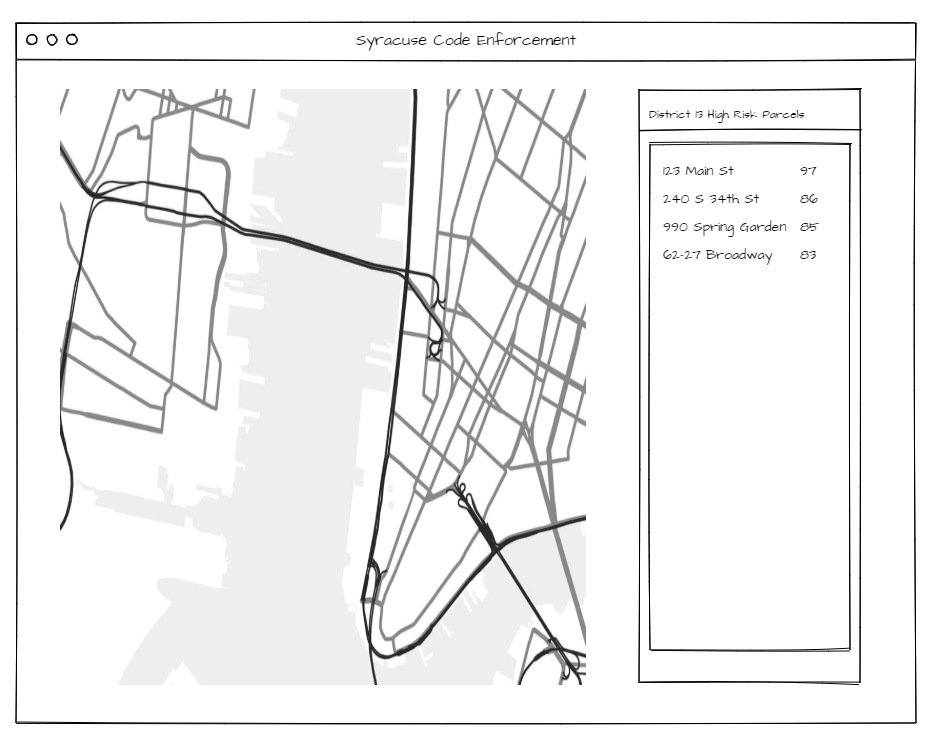

# Final Project Proposal

#### Your assignment this week is to write a detailed proposal for your final project. In proposing your final, try to address each of the following areas.

#### You can record it by editing this markdown file or creating a new one.

## Problem / Question

#### Applications are ultimately just tools. What problem or question does your application attempt to resolve or grapple with? How does your application speak to this problem/question?

The Syracuse Department of Code Enforcement (DOCE) is our client in another course. Faced with an aging housing stock and declining tax base, DOCE is seeking an updated standard operating procedure (SOP) to more effectively target properties that may violate building code. The application is a proof-of-concept of one portion of the new SOP, in which an inspector or manager with DOCE can identify parcels with a high risk of violation.

## The data

#### Geospatial applications are all about working with data. What datasets would you plan/like to use? If the data you'll be working with isn't already stored in a way that you can use, how will you be storing your data?

OpenData Syracuse provides data in CSV and GeoJSON format. This data has previously been processed in R, and "risk scores" have been generated for each parcel. This can be output in JSON and GeoJSON format as well.

## Technologies used

#### Which technologies covered in class (or discovered on your own!) do you plan to use? How do you anticipate using each of these technologies?

- Leaflet or Mapbox: interactive mapping  
- jQuery: HTML DOM manipulation and interaction  
- server-side scripting and database queries  

#### Review the APIs/online examples of leaflet, turf, jQuery, underscore (or any library not explicitly covered in class) for functions/uses which you'd like to explore. Briefly describe how you might use them.

- Leaflet: loading data, styling, panning/zooming, popups
- jQuery: AJAX calls, interactive styling and content, input handling
- server-side scripting and queries: handling and serving large datasets in smaller pieces

## Design spec

### User experience

#### At a high level, how do you expect people to use your application?
- #### Who are the users?
  Inspectors and managers at the Syracuse Department of Code Enforcement use the app to identify parcels and add them to their inspection queue.  
- #### What do they gain from your application' use?
  The app will offer information about the inspection priority of the properties based on a risk score. Other information about the parcel can similarly be displayed.
- #### Are there any website/application examples in the wild to which you can compare your final?
  The City of Philadelphia's [atlas.phila.gov](https://atlas.phila.gov/#/896-98%20N%2046TH%20ST/zoning) has a similar function and level of detail.

### Layouts and visual design

#### So far, we've built all our applications with a side bar for representing non-map content and navigation. This is not the only successful design. Extra content could be displayed in a top bar, through side bars on both sides, and any combination of these as well as a number not mentioned. Try to describe your application's visual layout. Conceptually (no need for extensive CSS here), what will this design require?

  

There will be three main views: 1) Syracuse at-a-glance, 2) individual district, and 3) parcel detail.  

| View                 | Map                                                                     | Sidebar                                                  |
| -------------------- | ----------------------------------------------------------------------- | ------------------------------------------------------- |
| Syracuse at-a-glance | Zoomed-out display of 22 inspection districts spanning all of the city. | Summary of each district's risk.                        |
| Individual district  | Zoom in to one the selected district. Parcels colored by risk level.    | A sorted list of the parcels in the selected district. |
| Parcel detail        | Further zoom in to the individual parcel.                               | A dashboard display of parcel details.               |

## Anticipated difficulties

#### Thinking about weaknesses can be useful. What do you anticipate being most difficult about this project? How will you attempt to cope with these difficulties? For example, asynchronous behavior (ajax, events) are hard to use and think about. Global variables are a strategy for coping with that difficulty by breaking data out of the asynchronous context.

- Interactive display and styling of map layers will be a hurdle. Depending on the action of the user, certain layers will have to be hidden, displayed, or styled in a certain way. The sidebar will also have to reflect the current state of the map.  
- The city of Syracuse has 40,000+ parcels. Because it is difficult to display this volume of polygons, only the relevant portion of this dataset should be served when the user asks for it. Server-side scripting or asynchronous JS may be necessary.

## Missing pieces

#### We've only managed to scratch the surface of the available technologies by which you could construct an application. What use-cases haven't we covered that you think would be useful? What technologies not covered seem exciting to you (you don't necessarily have to fully understand what they're for, this is a chance for you to get our help interpreting a technology's purpose/usage).

- How can Javascript be used to query a database and rapidly return only relevant information? 
